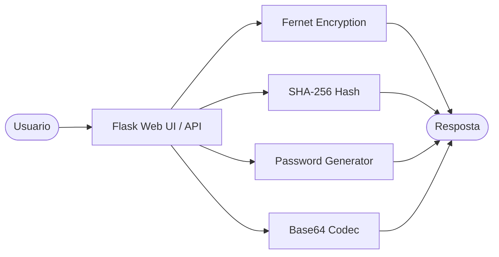
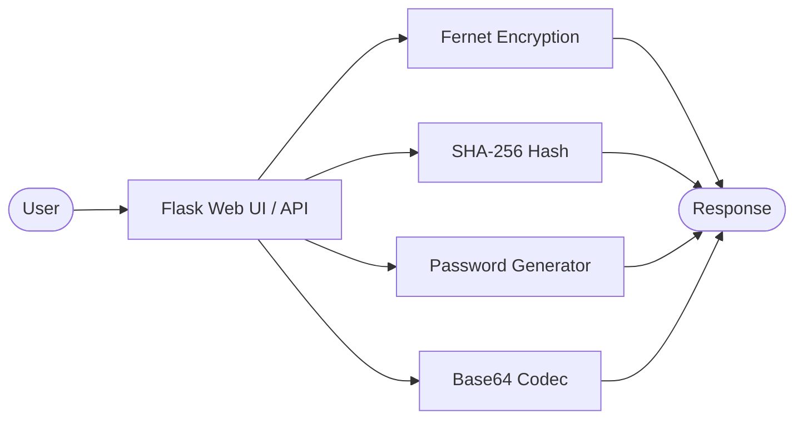

# Encryption Toolkit

[](https://python.org)
[](https://flask.palletsprojects.com)
[](https://cryptography.io)
[](LICENSE)

[Portugues](#portugues) | [English](#english)

---

## Portugues

### Visao Geral

Aplicacao web Python/Flask para operacoes criptograficas. Um unico arquivo fonte (`encryption_toolkit.py`, ~430 linhas) que oferece interface web interativa e API REST.

### Funcionalidades

- **Criptografia simetrica** — cifrar e decifrar texto com Fernet (AES-128-CBC + HMAC)
- **Hash de texto** — SHA-256, SHA-512, SHA-1, MD5
- **Gerador de senhas** — comprimento e conjunto de caracteres configuraveis
- **Codificacao Base64** — codificar e decodificar texto
- **Interface web** — UI interativa servida pelo Flask
- **API REST** — endpoints JSON para todas as operacoes

### Arquitetura



### Endpoints da API

| Metodo | Rota | Descricao |
|--------|------|-----------|
| POST | `/api/encrypt` | Cifrar texto |
| POST | `/api/decrypt` | Decifrar texto |
| POST | `/api/hash` | Gerar hash |
| POST | `/api/generate-password` | Gerar senha |
| POST | `/api/base64-encode` | Codificar Base64 |
| POST | `/api/base64-decode` | Decodificar Base64 |
| POST | `/api/generate-key` | Gerar chave Fernet |

### Inicio Rapido

```bash
git clone https://github.com/galafis/Encryption-Toolkit.git
cd Encryption-Toolkit
python -m venv venv
source venv/bin/activate  # Windows: venv\Scripts\activate
pip install -r requirements.txt
python encryption_toolkit.py
```

Acesse `http://localhost:5000` no navegador.

### Executar Testes

```bash
pip install pytest
pytest tests/ -v
```

### Estrutura do Projeto

```
Encryption-Toolkit/
├── encryption_toolkit.py   # Aplicacao (Flask + logica)
├── requirements.txt
├── tests/
│   ├── __init__.py
│   └── test_main.py
├── LICENSE
└── README.md
```

---

## English

### Overview

Python/Flask web application for cryptographic operations. A single source file (`encryption_toolkit.py`, ~430 lines) providing an interactive web interface and REST API.

### Features

- **Symmetric encryption** — encrypt and decrypt text with Fernet (AES-128-CBC + HMAC)
- **Text hashing** — SHA-256, SHA-512, SHA-1, MD5
- **Password generator** — configurable length and character sets
- **Base64 encoding** — encode and decode text
- **Web interface** — interactive UI served by Flask
- **REST API** — JSON endpoints for all operations

### Architecture



### API Endpoints

| Method | Route | Description |
|--------|-------|-------------|
| POST | `/api/encrypt` | Encrypt text |
| POST | `/api/decrypt` | Decrypt text |
| POST | `/api/hash` | Generate hash |
| POST | `/api/generate-password` | Generate password |
| POST | `/api/base64-encode` | Encode Base64 |
| POST | `/api/base64-decode` | Decode Base64 |
| POST | `/api/generate-key` | Generate Fernet key |

### Quick Start

```bash
git clone https://github.com/galafis/Encryption-Toolkit.git
cd Encryption-Toolkit
python -m venv venv
source venv/bin/activate  # Windows: venv\Scripts\activate
pip install -r requirements.txt
python encryption_toolkit.py
```

Open `http://localhost:5000` in your browser.

### Run Tests

```bash
pip install pytest
pytest tests/ -v
```

### Project Structure

```
Encryption-Toolkit/
├── encryption_toolkit.py   # Application (Flask + logic)
├── requirements.txt
├── tests/
│   ├── __init__.py
│   └── test_main.py
├── LICENSE
└── README.md
```

### License

MIT — see [LICENSE](LICENSE).

### Author

**Gabriel Demetrios Lafis**
- GitHub: [@galafis](https://github.com/galafis)
- LinkedIn: [Gabriel Demetrios Lafis](https://linkedin.com/in/gabriel-demetrios-lafis)
